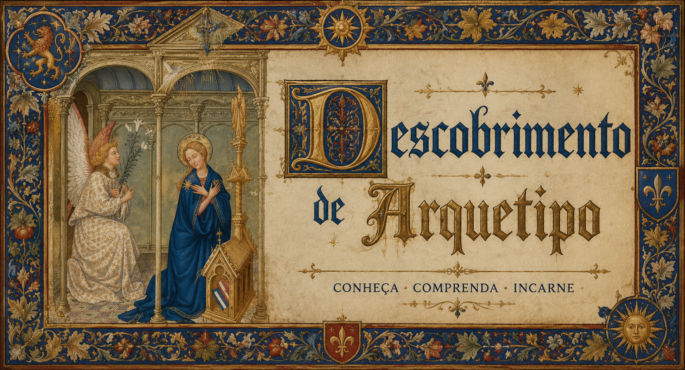

# ArcheTypos — Exame Junguiano dos Doze Arquétipos

Site 100% estático em **HTML, CSS e JavaScript puro** — sem build, sem
Node, sem dependências. Basta arrastar os arquivos para o GitHub e ativar
o Pages.

## Estrutura

```
index.html          → página única, carrega os scripts em ordem
style.css            → tema visual medieval (pergaminho, fontes góticas)
js/
  archetypes.js      → definição dos 12 arquétipos e análise técnica
  questions.js        → banco de 108 afirmações Likert
  scoring.js          → cálculo de pontuação e dominante/secundário
  storage.js          → persistência via localStorage
  icons.js            → ícones SVG originais (estilo xilogravura)
  ui-intro.js          → tela inicial
  ui-quiz.js           → tela do questionário
  ui-result.js         → tela de resultado
  main.js              → orquestrador das telas (carregar por último)
```

Nenhum arquivo usa `import`/`export` — tudo é carregado via `<script>`
normal no `index.html`, na ordem certa, e as funções ficam disponíveis
globalmente no navegador.

